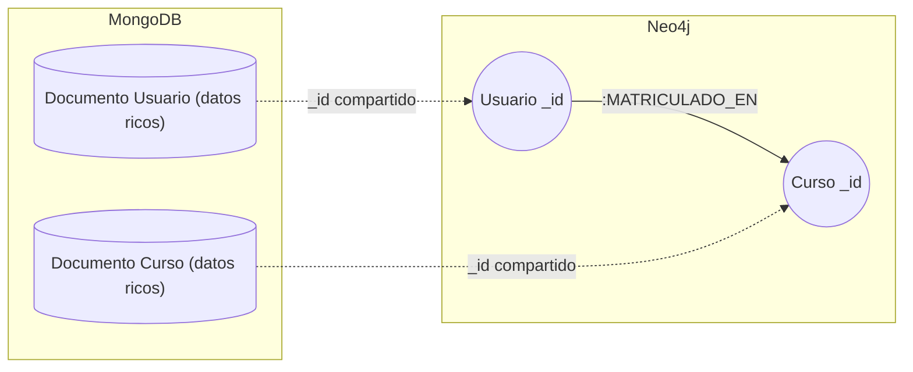
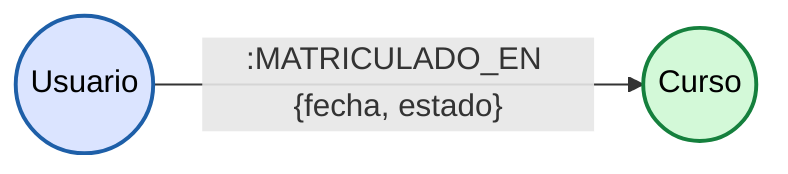
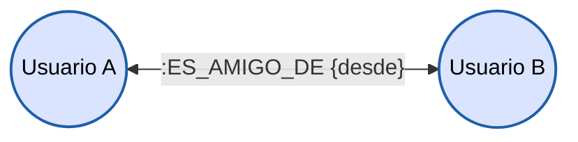
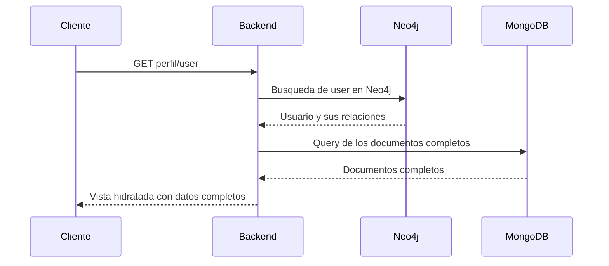
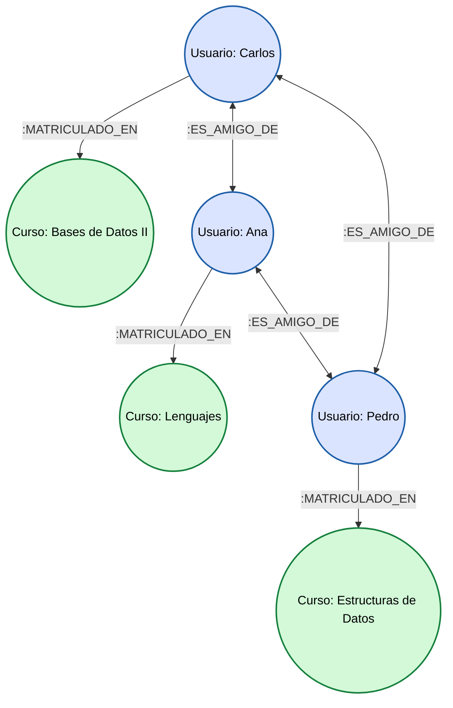

# Justificacion de uso de Neo4j


Se usara Neo4j para mapear las relaciones entre usuarios y cursos, y entre usuarios y amigos.
Para visualizar esto podemos observar que MongoDB almacena los datos ricos de los usuarios,
haciendo uso de Neo4j podriamos simplemente crear un usuario con el `_id` del usuario dentro de MongoDB,
de igual forma se haria la creacion de los nodos de cursos. De este modo se podria mapear las relaciones en un
ambiente `index-free` que permite Neo4j y establecer relaciones de usuarios matriculados a x curso en tiempo constante.



### Ventajas de este enfoque

* Rendimiento:
    `Index-Free Adjacency` permite saltar de un nodo a otro en tiempo O(1),
    sin importar el tamaño total de la base de datos.
* Desacoplamiento:
    Al asignarle la carga de las relaciones a Neo4j, se libera a MongoDB de almacenar arreglos enormes de referencias.
* Schemaless:
    Permite agregar nuevas relaciones sin alterar el esquema existente.

---

## Modelado de la base de datos y relaciones

En Neo4j todo se reduce a entidades (nodos) y relaciones (aristas), ambos pueden tener propiedades key-value.

### Relacion de matricula

La matricula no es algo estatico sino una accion que conecta a un estudiante con el curso que matriculo.

* Nodos involucrados:
    `(:Usuario)` y `(:Curso)`. Solo almacenan el id unico para relacionarse con los documentos completos en MongoDB.
* Relacion:
    `[:MATRICULADO_EN]`. Arista direccional que apunta de Usuario a Curso.
* Propiedades de la relacion:
    Los datos propios de la transaccion (fecha, estado, semestre) viven dentro de la flecha, no en los nodos.

```cypher
// Crear relacion de matricula entre nodos existentes
MATCH (u:Usuario {id: "user"}), (c:Curso {id: "curso"})
CREATE (u)-[:MATRICULADO_EN {fecha: "2026-xx-xx", estado: "ACTIVO", semestre: "I-2026"}]->(c)
```



---

### Relacion de amistad

Las redes sociales dentro de la plataforma se modelan conectando nodos del mismo tipo.

* Nodos involucrados:
    `(:Usuario)` en ambos extremos.
* Relacion:
    `[:ES_AMIGO_DE]`. Aunque todas las relaciones en Neo4j tienen una direccion tecnica al crearse (se trata como una conexion mutua).
* Propiedades de la relacion:
    Datos del vinculo social (fecha de inicio, etc.).

```cypher
// Crear amistad entre dos usuarios existentes
MATCH (u1:Usuario {id: "user"}), (u2:Usuario {id: "user2"})
CREATE (u1)-[:ES_AMIGO_DE {desde: "2026-xx-xx"}]->(u2)
```



---

## Flujo de hidratacion
Que es hidratar? Es el proceso de tomar los datos de los nodos y relaciones de Neo4j y combinarlos con los datos de los documentos de MongoDB para obtener la vista completa del usuario.

Cuando se solicita el perfil de un usuario, el backend sigue este flujo:

1. Consulta Neo4j para obtener la red del usuario.
2. Con esos identificadores, el backend hace una consulta a MongoDB.
3. MongoDB devuelve los documentos completos.
4. La vista se **hidrata** con esos datos.



---

## Vista general del grafo del proyecto

El siguiente diagrama muestra un ejemplo de como lucen los nodos y relaciones en la base de datos.

